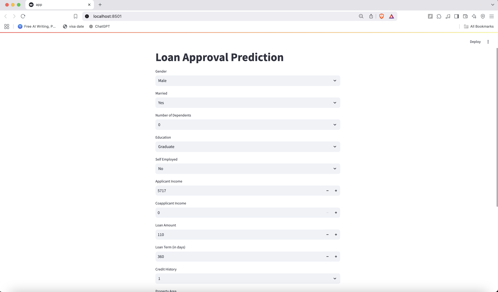
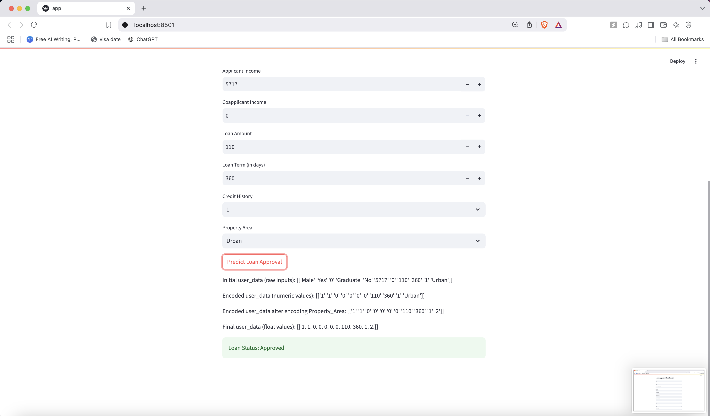

# loan-eligibility-analysis

This is a Streamlit-based application that predicts loan approval status based on user inputs. The app utilizes a pre-trained machine learning model to make predictions about whether a loan should be approved or rejected.

## Features

- **User Inputs**: Users provide details such as gender, marital status, education, income details, and property area.
- **Prediction**: The app predicts whether the loan is approved or rejected based on the input data.
- **Machine Learning Model**: The model used in the app is trained using a dataset with relevant features, and it predicts the loan approval status.
- **Data Preprocessing**: The app encodes categorical inputs (e.g., gender, education, etc.) before feeding them into the model for prediction.

## Requirements

To run this app locally, you need the following Python libraries:

- `streamlit`
- `pickle`
- `numpy`
- `scikit-learn`
  
## Screenshots

Below are screenshots of the Loan Approval Prediction app:

  
Here you can input the data from a menu based technique

  
Here you can hit predict and then see the result of the loan

## Model Details

The machine learning model used for loan approval prediction was trained using a dataset containing the following features:

- **Gender**: Male or Female
- **Marital Status**: Yes or No
- **Number of Dependents**: 0, 1, 2, or 3+
- **Education**: Graduate or Not Graduate
- **Self-Employed**: Yes or No
- **Applicant Income**: Numeric value representing the income of the applicant
- **Coapplicant Income**: Numeric value representing the income of the coapplicant
- **Loan Amount**: Numeric value representing the amount of loan requested
- **Loan Term**: Numeric value representing the term of the loan in days
- **Credit History**: Binary (1 for good credit history, 0 for bad credit history)
- **Property Area**: Urban, Rural, or Semiurban

The model was trained and pickled for use in the app.

## How It Works

1. The user inputs values for the above features.
2. The app encodes categorical values (such as `Gender`, `Marital Status`, etc.) using label encoding.
3. The encoded data is passed into the pre-trained model for prediction.
4. The app outputs whether the loan is "Approved" or "Rejected" based on the model's prediction.

## Real-World Application

The Loan Approval Prediction app is a valuable tool for financial institutions, such as banks and credit companies, to automate the process of evaluating loan applications. In a real-world scenario, lenders typically use a set of criteria to assess a borrower's eligibility, including income, credit history, employment status, and property area.

This application simplifies and speeds up the decision-making process by using a machine learning model that can accurately predict whether a loan should be approved or rejected based on the following inputs:

- **Gender**
- **Marital Status**
- **Number of Dependents**
- **Education**
- **Self-Employed Status**
- **Applicant Income**
- **Coapplicant Income**
- **Loan Amount**
- **Loan Term**
- **Credit History**
- **Property Area**

By automating this process, the app reduces the manual effort and time required for loan approval, helping lenders make quicker and more consistent decisions. It also helps eliminate human biases that may affect the loan approval process.

Additionally, this app can be customized and integrated into financial institutions' existing systems, providing an efficient, data-driven way to evaluate loan applicants and make well-informed financial decisions. The use of machine learning algorithms ensures that the model continues to learn and improve over time as new data becomes available.

In summary, the Loan Approval Prediction app is a practical tool for financial institutions seeking to enhance their loan approval workflows, providing faster, more accurate, and fairer loan decisions.
